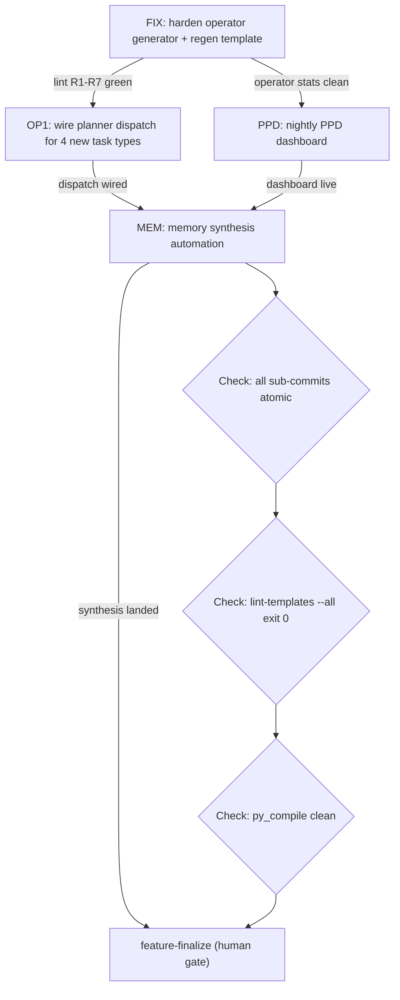

# Option A — Consolidated BRAID work order

**Target:** top-level codex orchestrator agent. Spawn one subagent per task. Follow the dependency graph strictly.

## Dependency graph



## Shared context (inject into every subagent)

```yaml
project_root: ${ORCH_ROOT}
canonical_repos:
  lvc-standard:            ${LVC_STANDARD_ROOT}
  dag-framework:           ${DAG_FRAMEWORK_ROOT}
  trade-research-platform: ${TRP_ROOT}
git_identity:
  name:  devmini-orchestrator
  email: devmini-orchestrator@joshorig.com
hard_invariants:
  - BRAID templates atomic_rename only; braid_template_write enforces R1-R7 before os.rename.
  - Every task carries explicit `engine` field (claude|codex|qa). No implicit routing.
  - Workers bounded: one task per run, then sys.exit(0).
  - Agent commits force-push with --force-with-lease only. Never bypass hooks.
  - Secrets never committed. Never --no-verify.
  - No file Read of bin/orchestrator.py or bin/worker.py wholesale; use token-savior symbol lookup.

token_savior_bootstrap: &ts
  must_call_first:
    - mcp__token-savior__set_project_root(path=<abs_repo_path>)
    - mcp__token-savior__switch_project(name=<alias>)
    - mcp__token-savior__get_project_summary()
  targeted_reads:
    - mcp__token-savior__find_symbol(name=...)
    - mcp__token-savior__get_function_source(name=...)
    - mcp__token-savior__get_class_source(name=...)
    - mcp__token-savior__search_codebase(query=...)
    - mcp__token-savior__get_edit_context(symbol=...)
  fallback: "If token-savior index misses a symbol, Grep/Glob — never full-file Read of >500-line files."
```

---

## FIX — Harden `lvc-implement-operator` generator + regen template

**Depends on:** nothing. Run first.

**Preconditions:**
- Workers stopped.
- `braid/templates/lvc-implement-operator.mmd` dirty (R4-violating subgraph shape, shared Revise node).
- `orchestrator.py lint-templates --template lvc-implement-operator` currently exits 1 with `error R4: distinct Revise nodes are underspecified`.

**Subagent instructions:**
```
1. token_savior_bootstrap: *ts on ${ORCH_ROOT}
2. Read braid/generators/lvc-implement-operator.prompt.md (in full — small file).
3. Edit the generator prompt:
   a. Add mandatory rule: "One distinct Revise node per Check gate. Name them ReviseCheck1, ReviseCheck2, ..., ReviseCheckN. Shared Revise nodes across gates are FORBIDDEN — this is BRAID paper Appendix A.4 principle 4, enforced locally as lint rule R4."
   b. Add a worked example showing a flat (non-subgraph) topology with >=3 Check gates, each routing its failed path to its own ReviseCheck<N>, which then loops back to the correct Draft node.
   c. Add an explicit "DO NOT" section naming: subgraph { ... }, single shared Revise, bare unlabeled edges, prose nodes >15 tokens.
4. Delete braid/templates/lvc-implement-operator.mmd.
5. Regenerate via the orchestrator's template_missing path:
   python3 bin/orchestrator.py braid-regen lvc-implement-operator
   (If that CLI does not exist, use find_symbol braid_template_write + invoke claude -p with the hardened prompt and pipe output through braid_template_write. The linter will block any R1-R7 violation.)
6. Verify: python3 bin/orchestrator.py lint-templates --template lvc-implement-operator → exit 0.
7. Smoke-verify the regenerated graph by inspecting the node labels:
   grep -E '^\s*Revise' braid/templates/lvc-implement-operator.mmd
   Expect >=3 distinct ReviseCheck<N> nodes.
8. git add braid/generators/lvc-implement-operator.prompt.md braid/templates/lvc-implement-operator.mmd braid/index.json
9. git commit -m "braid: harden operator generator to require distinct Revise per gate"
```

**Output contract (Check gates):**
- `Check: lint-templates --template lvc-implement-operator == 0`
- `Check: >=3 distinct ReviseCheck<N> nodes in the new .mmd`
- `Check: braid/index.json hash updated (not 0b503b66...)`
- `Check: one atomic commit on feature/opt-a`

**Topology-error reasons accepted:**
`template_missing`, `graph_unreachable`, `graph_malformed`. Anything else → `false_blocker_claim` → halt, human required.

---

## OP1 — Complete slice replication (planner dispatch wiring)

**Depends on:** FIX (operator template must lint clean before planner emits operator tasks).

**Preconditions:**
- 4 generator prompts already exist (dag-implement-node, dag-historian-update, trp-implement-pipeline-stage, trp-ui-component) — untracked in git.
- Templates intentionally absent. First task per type hits template_missing → regen → linter gate.

**Subagent instructions:**
```
1. token_savior_bootstrap: *ts on ${ORCH_ROOT}
2. Discovery (no wholesale reads):
   mcp__token-savior__find_symbol(name="tick_planner")         # bin/orchestrator.py
   mcp__token-savior__find_symbol(name="run_claude_planner")   # bin/worker.py
   mcp__token-savior__find_symbol(name="classify_slice")       # bin/worker.py
   mcp__token-savior__find_symbol(name="create_feature")       # bin/orchestrator.py
   Read each via get_function_source only.
3. Read local orchestrator config (small) for project->type mapping.
4. Extend tick_planner:
   - Per project, when emitting a feature header + seed task, set braid_template to the project-specific historian task type:
       lvc-standard            → lvc-historian-update
       dag-framework           → dag-historian-update
       trade-research-platform → trp-historian-update (if prompt exists — check, else fall back to lvc-historian-update)
   - For implementer children emitted by claude planner, pass a project-specific implementer key:
       lvc-standard            → lvc-implement-operator
       dag-framework           → dag-implement-node
       trade-research-platform → trp-implement-pipeline-stage | trp-ui-component (picked by classify_slice)
5. Extend classify_slice (worker.py):
   - dag-implement-node       positive: ["node", "operator", "processing-element", "dag", "pipeline-node"]
   - dag-historian-update     positive: ["history", "memory", "RECENT_WORK", "historian"]
   - trp-implement-pipeline-stage positive: ["stage", "pipeline", "platform-runtime", "ingest", "jmh"]
   - trp-ui-component         positive: ["component", "page", ".tsx", "playwright", "a11y", "apps/"]
   - Anti-patterns: slice crossing project boundaries; slice with empty braid_template when a project-specific template exists; slice targeting UI paths but classified as pipeline-stage (and vice versa).
6. Add inline doctests to classify_slice:
   - >=3 accept + >=3 reject cases per new type (24 cases minimum).
7. Validate: python3 -m doctest bin/worker.py
8. Validate: python3 -m py_compile bin/orchestrator.py bin/worker.py
9. Synthetic dispatch dry-run:
   python3 bin/orchestrator.py enqueue --engine=codex --role=historian --project=dag-framework --braid-template=dag-historian-update --summary="bootstrap dag historian"
   Confirm: template_missing → blocked → claude regen → lint-templates --template dag-historian-update exit 0 → task re-queued.
   Repeat for dag-implement-node, trp-implement-pipeline-stage, trp-ui-component.
10. Validate all templates: python3 bin/orchestrator.py lint-templates --all → exit 0 for all 8 task types.
11. git add bin/orchestrator.py bin/worker.py braid/generators/ braid/templates/ braid/index.json
12. git commit -m "braid: wire planner dispatch for dag + trp task types"
```

**Output contract (Check gates):**
- `Check: 8 lint-clean templates present in braid/templates/`
- `Check: classify_slice doctests all pass`
- `Check: tick_planner emits project-correct braid_template in a synthetic enqueue`
- `Check: py_compile clean`
- `Check: one atomic commit on feature/opt-a`

---

## PPD — Nightly PPD dashboard

**Depends on:** FIX (so operator stats are clean before aggregation).
**Parallel with:** OP1.

**Subagent instructions:**
```
1. token_savior_bootstrap: *ts on ${ORCH_ROOT}
2. Discovery:
   mcp__token-savior__find_symbol(name="tick_reports")
   mcp__token-savior__find_symbol(name="report_command")
   mcp__token-savior__search_codebase(query="input_tokens output_tokens")
3. Read braid/index.json (small).
4. Create bin/ppd_report.py:
   inputs:
     - braid/index.json (uses, topology_errors per template)
     - logs/*.log (scan last 24h for JSON lines containing "input_tokens"/"output_tokens"; aggregate per slot)
     - queue/done/ and queue/failed/ counts (last 24h by mtime)
   computes:
     - error_rate_pct per template
     - tokens_per_task per slot
     - crude PPD: tasks_completed / (input_tokens + output_tokens)
   emits:
     reports/ppd-<YYYYMMDD>.md with a markdown table + a 7-day rolling trend line (tail last 7 files if present).
5. Plumb into morning report:
   mcp__token-savior__find_symbol(name="tick_reports_morning")
   Append: "if ppd-<today>.md exists, concatenate to reports/morning-<YYYYMMDD>.md."
6. launchd plist:
   ~/Library/LaunchAgents/com.devmini.orchestrator.ppd-report.plist
   StartCalendarInterval: 07:45 daily
   ProgramArguments: /opt/homebrew/bin/python3 ${ORCH_ROOT}/bin/ppd_report.py
7. Smoke test:
   python3 bin/ppd_report.py --dry-run
   Expect: reports/ppd-<today>.md created with >=1 row per template, one row per slot.
8. Validate: python3 -m py_compile bin/ppd_report.py
9. git add bin/ppd_report.py bin/orchestrator.py ~/Library/LaunchAgents/com.devmini.orchestrator.ppd-report.plist
10. git commit -m "ppd: nightly report over braid stats + per-slot token counts"
```

**Output contract:**
- `Check: reports/ppd-<today>.md emitted by standalone run`
- `Check: morning-report concatenation path covered`
- `Check: plist loads with launchctl load`
- `Check: one atomic commit on feature/opt-a`

---

## MEM — Memory synthesis automation

**Depends on:** OP1 AND PPD.

**Subagent instructions:**
```
1. token_savior_bootstrap on each canonical repo (switch_project per repo):
     lvc-standard, dag-framework, trade-research-platform
2. Discovery (orchestrator repo):
   mcp__token-savior__find_symbol(name="run_claude_reviewer")   # reuse claude invocation shape
   mcp__token-savior__find_symbol(name="braid_template_write")
3. Hand-author braid/generators/memory-synthesis.prompt.md (shared across repos — project supplied as context var).
   Encode:
     - Inputs: repo-memory/RECENT_WORK.md (last 50 entries), repo-memory/CURRENT_STATE.md (full), repo-memory/DECISIONS.md (full)
     - Output: a DELTA patch to CURRENT_STATE.md only. Never a full rewrite. Never touch RECENT_WORK.md.
     - Hard rules: 4 BRAID principles + "no new section headers unless an active subsystem was actually added."
     - Check gates: delta < 200 lines; no secrets (regex: AKIA|BEGIN PRIVATE KEY|token.*=); RECENT_WORK.md byte-identical after run; CURRENT_STATE.md still lint-clean markdown.
4. Trigger regen via orchestrator template_missing path so the linter validates the .mmd:
   python3 bin/orchestrator.py enqueue --engine=claude --role=planner --braid-template=memory-synthesis --summary="bootstrap memory-synthesis template"
5. Verify: python3 bin/orchestrator.py lint-templates --template memory-synthesis → exit 0.
6. Add orchestrator task type `memory-synthesis`:
   - engine=claude, role=historian
   - Serialized by feature system (one per project per run).
   - Enqueued by new tick_memory_synthesis (orchestrator.py).
7. tick_memory_synthesis:
   - For each project, check repo-memory/CURRENT_STATE.md mtime.
   - If age > 7 days OR --force flag passed, enqueue a memory-synthesis task for that project.
   - Dedupe via feature-id in_flight check.
8. launchd plist:
   ~/Library/LaunchAgents/com.devmini.orchestrator.memory-synth.plist
   StartCalendarInterval: Sunday 06:00
   ProgramArguments: orchestrator.py tick-memory-synthesis
9. Validate: python3 -m py_compile bin/orchestrator.py
10. Validate: python3 bin/orchestrator.py lint-templates --all (all 9 task types clean).
11. git add braid/generators/memory-synthesis.prompt.md braid/templates/memory-synthesis.mmd braid/index.json bin/orchestrator.py ~/Library/LaunchAgents/com.devmini.orchestrator.memory-synth.plist
12. git commit -m "braid: memory synthesis automation (weekly per project)"
```

**Output contract:**
- `Check: braid/templates/memory-synthesis.mmd lint-clean`
- `Check: tick_memory_synthesis enqueues a task for a project with mtime >7 days old`
- `Check: dry-run against lvc-standard produces a delta <200 lines, RECENT_WORK.md unchanged`
- `Check: one atomic commit on feature/opt-a`

---

## Final — feature-finalize + re-enable

After FIX, OP1, PPD, MEM all commit on `feature/opt-a` and `pr-sweep` auto-merges their task PRs:

```
1. python3 bin/orchestrator.py feature-finalize
   → opens ONE feature/opt-a → main PR for human review.
2. Human reviews + merges.
3. Re-enable workers:
   for p in ~/Library/LaunchAgents/com.devmini.orchestrator.*.plist; do
     launchctl unload "$p" 2>/dev/null
     launchctl load "$p"
   done
4. Sanity:
   launchctl list | grep devmini.orchestrator | wc -l   # expect 21 (20 prior + ppd-report + memory-synth = 22 — adjust)
   python3 bin/orchestrator.py status
```

---

## Execution protocol for the receiving codex agent

```
1. Create feature_id: opt-a.
2. Spawn 4 subagents as parallel children, one per task (FIX, OP1, PPD, MEM).
3. Enforce sequencing via explicit blocking:
     - OP1 blocks on FIX BRAID_OK
     - PPD blocks on FIX BRAID_OK
     - MEM blocks on (OP1 AND PPD) BRAID_OK
4. Each subagent MUST start with the token_savior_bootstrap block. No Read on orchestrator.py or worker.py wholesale. Use find_symbol + get_function_source.
5. On BRAID_OK: commit + report. On BRAID_TOPOLOGY_ERROR: move task to blocked/, halt dependents, alert human. Valid reason codes: template_missing | graph_unreachable | graph_malformed | baseline_red. Anything else = false_blocker_claim = halt.
6. Every subagent emits a single atomic commit. No amending. git identity: devmini-orchestrator <devmini-orchestrator@joshorig.com>.
7. Final validation before feature-finalize:
     python3 -m py_compile bin/orchestrator.py bin/worker.py bin/ppd_report.py
     python3 bin/orchestrator.py lint-templates --all   # all clean
     python3 -m doctest bin/worker.py
8. feature-finalize opens the single feature→main PR. Human merges. Workers re-enabled only after merge.
```
